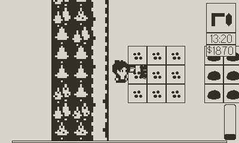
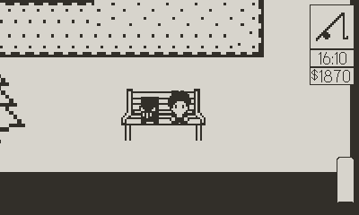
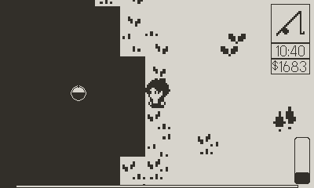
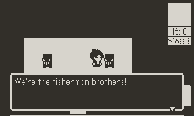

# Farmbound

Farmbound is a farming simulation game developed for the Playdate console. Inspired by Stardew Valley and the Harvest Moon / Story of Seasons franchise.

## Game Info

The game features farming and fishing as the key mechanics. An objective system is present that gives the player different tasks to complete. Failing to complete these on time will result in a game over! View the [game manual](MANUAL.md) for more details.

## Images






## Setup

If you just want to play, you can find a compiled pdx under the [releases section](https://github.com/Jacky161/Farmbound/releases). This can be used with the Playdate Simulator or the actual console. To install the game on the console, please refer to Panic's [official instructions for sideloading games](https://help.play.date/games/sideloading/).

## Dev

If you want to compile the game yourself, you'll need to install the [Playdate SDK](https://play.date/dev/) and use the `pdc` compiler to compile the pdx.

[Playdate Debug](https://marketplace.visualstudio.com/items?itemName=midouest.playdate-debug) is a handy VSCode extension. With this extension installed, you can press `F5` in VSCode to automatically compile and launch the Playdate Simulator, without having to manually run `pdc`.

[Playdate LuaCATS](https://github.com/notpeter/playdate-luacats) is also nice for getting some autocomplete working. LuaCATS is included as a submodule in this repository. You should clone the repository using:

```bash
# You can clone with SSH if you prefer.
git clone https://github.com/Jacky161/Farmbound.git --recursive

# ALTERNATIVELY, if you already cloned without --recursive
git clone https://github.com/Jacky161/Farmbound.git
cd Farmbound
git submodule update --init
```

## License

This project is licensed under the MIT license with some notable exceptions as follows.

- [source/code/helpers/worldloader.lua](source/code/helpers/worldloader.lua) is licensed under the BSD Zero Clause License. This is heavily modified from `Examples/Level 1-1/Source/levelLoader.lua` file in the Playdate SDK. See the file for more details on the license.
- [source/libraries/pulp-audio/pulp-audio.lua](source/libraries/pulp-audio/pulp-audio.lua) is obtained from the [Pulp editor](https://play.date/pulp) to use Pulp Music & SFX in lua games. I am not aware of the license for this file.
- The player sprites is obtained from [Mystic Woods by Game Endeavor](https://game-endeavor.itch.io/mystic-woods)
- The paths, and nature sprites are obtained from [Bountiful Bits by VEXED](https://v3x3d.itch.io/bountiful-bits)
- The house on the farm is not created by me. The original source appears to be gone, but if you are the original author, please feel free to reach out so you can be credited.
