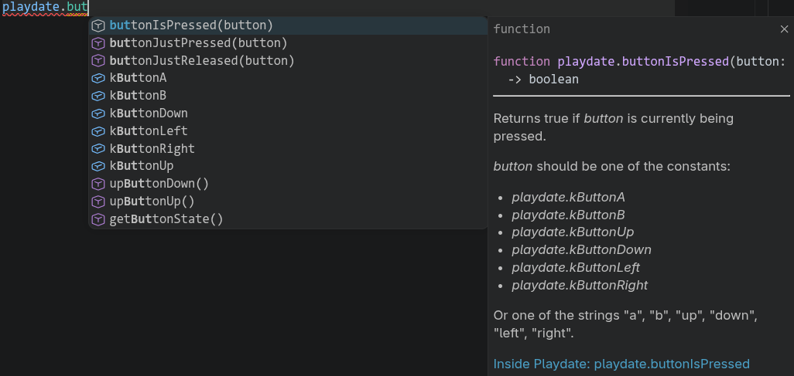

# Playdate Development Tips

From spending a few months working on Farmbound, I've learned quite a number of things about Playdate development that will probably be helpful to the aspiring Playdate developer. Here they all are in no particular order.

## ToC

- [SDK Docs](#sdk-docs)
- [VSCode Setup](#vscode-setup)
- [Project Organisation](#project-organisation)
- [Sprites](#sprites)
- [Timers](#timers)
- [Level Editors](#level-editors)
- [Playdate Simulator and the Playdate Console](#playdate-simulator-and-the-playdate-console)

## SDK Docs

- [Inside Playdate](https://sdk.play.date/inside-playdate)
- [Designing for Playdate](https://help.play.date/developer/designing-for-playdate/)

Panic has wonderful documentation that describes everything you need to know about the Playdate SDK, all the provided library functions, and more.

The **Inside Playdate** page will be invaluable as you develop your game, and I constantly used it to reference API functions that I would need. I would recommend at least skimming this page once so you can have an idea of what tools you have available to you.

I would encourage you to give a full read over of the **Designing for Playdate** page, which provides tips on how to properly design your game for the Playdate. It gives recommendations on things such as sprite sizes which is relevant given the size of the Playdate screen.

Note that the Playdate SDK has a ton of examples if you look inside the Examples folder in the SDK. These may be a helpful reference as you start developing your game.

## VSCode Setup

### Linting and Autocomplete

If you're anything like me, you probably use auto complete in your IDE a lot (and if you don't, you should try it!)

With proper setup, you can simply type `playdate.` and all the valid functions, as well as documentation on what they do, as well as their parameters will appear right there. This saves a lot of time scrolling through the API reference, and provides the info there right at your finger tips. It also helps to reduce mistakes such as using the wrong parameters for a given function.


*Handy!*

To set this up, you'll need to setup [Playdate LuaCATS](https://github.com/notpeter/playdate-luacats). Instructions are on the page under the "How do I use it?" section. See the `.luarc.json` in this repository for an example. This file needs to be in the root of the folder you open in VSCode. Make sure to install the [Lua Extension](https://marketplace.visualstudio.com/items?itemName=sumneko.lua) for VSCode.

Note that VSCode will still provide a bunch of erroneous warnings throughout your code. As I'm typing, my project apparently has 504 warnings! :)

### Playdate Debug

[Playdate Debug](https://marketplace.visualstudio.com/items?itemName=midouest.playdate-debug) is a handy extension that will automatically compile your game and launch it in the simulator. To do this, install the extension, have one of your lua files open, and then press `F5`. It should build your game with `pdc`, and then launch the simulator automatically.


## Project Organisation

As your game gets larger, you will probably find yourself creating more and more lua files. The file structure that Panic recommends is as follows:

```
[myProjectName]/
    source/
        main.lua
        ...and other .lua files
        images/
            [myImageFile1].png
            [myImageFile2].png
            ...and so on
        sounds/
            [myAudioFile1].wav
            [myAudioFile2].mp3
            ...and other ADPCM- or MP3-formatted files
    support/
        Project files including Photoshop assets, project outlines, etc.
```
*From the Playdate SDK site.*

You will find that my game mostly follows this structure apart from the organisation of the `.lua` files. The suggested structure is to place all `.lua` files in the same folder. However in a large project with lots of lua files, this can become messy quickly. I suggest placing your `.lua` files in subfolders based on their purpose. For example, files related to in game items can be placed in an `items` folder. In my game, I placed all `.lua` files except for `main.lua` inside a `code` folder, and have subdirectories based on use from there.

### Importing Lua Files

When importing `.lua` files, you can either specify the absolute or relative path to the file you want to import. I personally recommend sticking to absolute paths, as this will be less problematic and more clear overall in my experience. The absolute paths are based off of the `source` folder. So for example, if I have a file named `source/code/foo.lua` and I want to import it in `source/code/bar.lua`, I would write:

```lua
import "code/foo"  -- absolute path (recommended)
import "foo"       -- relative path (not recommended)
```

### Case Sensitivity of Imports

Note that imports are case sensitive on the actual console. If your file is named `foo.lua`, you must use all lowercase in the import, or else you may have issues with the game working in the simulator, but not the actual console. This is likely because Windows and MacOS are both case-insensitive by default for file naming.


## Sprites

The Playdate SDK allows you to create sprites. A `sprite` is a class that can either be directly instantiated or you may choose to extend and create subclasses. You'll see throughout my code that I opt for the latter approach, which is what I would recommend apart from extremely simple cases.

Sprites, despite their name, can be used for so much more than just, well, sprites. It is helpful to think of them as a building block of all your visual elements. For example, UI elements, in-game menus, etc can all be implemented using sprites. See the `source/code/ui` folder for examples.

This has a number of advantages over directly drawing these elements, such as being able to easily control the rendering order using the `ZIndex`, having an automatically available `update` function to place logic into, etc. There is lots of different functionality that sprites allow, which is why using them for all your visual elements is so handy. It also makes it easier to change things later on. For example, moving a UI element can be as simple as changing the (x, y) of the sprite, rather than modifying all your draw calls manually.

### Sprite Implementation

There are two ways to implement sprites. One way is to set an image on a sprite, and the other is to manually implement the `draw` function.

#### Image Based

```lua
import "CoreLibs/sprites"

class('MySprite').extends(playdate.graphics.sprite)

local image = playdate.graphics.image.new("coin")

function MySprite:init(x, y)
    MySprite.super.init(self) -- this is critical
    self:setImage(image)
    self:moveTo(x, y)
end

local sprite = MySprite(100, 100)
sprite:add()
```
*Example from Playdate SDK site.*

This code creates a new sprite with the image `coin`, moves them to (100, 100), and adds it to the display list. The coordinates are provided through the constructor arguments. Note that by default, coordinates are based on the centre of the sprite. That means the centre of the image is at (100, 100).

#### Draw Function Based

Sometimes, an image is not suitable for implementing a sprite. For example, consider a textbox that displays text of a speaking character onto the screen (check `source/code/ui/textbox.lua` for an example of this). In this case, we can manually implement the draw function instead. Inside the draw function, you can use the standard graphics methods to draw out the shapes of your sprite.

```lua
import "CoreLibs/sprites"

local BOX_WIDTH <const> = 10
local BOX_HEIGHT <const> = 10

class("Box").extends(gfx.sprite)
function Box:init(x, y)
    Box.super.init(self)

    -- You must use either setBounds or setSize or else the draw function will not be invoked
    self:setBounds(x, y, BOX_WIDTH, BOX_HEIGHT)
end

function Box:draw(x, y, width, height)
    gfx.setColor(gfx.kColorWhite)
    gfx.fillRect(0, 0, BOX_WIDTH, BOX_HEIGHT)
end

local sprite = Box(100, 100)
sprite:add()
```

This code draws a box with the top-left corner located at the given (x, y). Note that this is different than the image based approach where the coordinates represented the middle of the sprite.

All coordinates inside the draw function are relative to the sprite's top left corner. Thus, when we call `fillRect`, we are telling it to draw a rectangle at (0, 0) which represents the top left of the sprite.

The draw function has the signature `draw(x, y, width, height)`. According to the Playdate SDK documentation, "The rect passed in is the current dirty rect being updated by the display list." In practice, these arguments are not very useful and can be ignored.

## Timers

Timers are extremely useful for handling animations or anything that needs to occur after a delay. You can have value timers with a specific start value, end value, and interval. The timer will increment the value from start to end over that interval. This is useful for animations such as the fishing powerbar in my game, as well as the fade in/out on day transitions. You can also set the timer to reverse from end to start, as well as repeat indefinitely. Timers can even call functions after ending, as well as on every update. See `source/code/ui/effects/effect_auto_powerbar.lua` for a simple example.

## Level Editors

Using a level editor such as LDtk or Tiled can be incredibly helpful depending on the kind of game you are making. Using a level editor, you can design the map of your game, export that map, and have the game reflect your changes, all without having to make any code changes.

You can do much more than just design your map as well. In my game, I designated specific named coordinates in Tiled, and had my game lookup these from the map file to spawn NPCs at. Specific tiles can be designated to have collision or not, loading zones can be marked using specific tiles, etc. These are all things I used my level editor to do.

Tiled is relatively more complicated to setup on Playdate compared to LDtk. You can find the code I used for Tiled inside `source/code/world.lua` and `source/code/helpers/worldloader.lua`. `worldloader.lua` is the file that loads the Tiled `.json` file, and is heavily based on the `levelLoader.lua` file inside the Playdate SDK example "Level 1-1" which also uses Tiled.

LDtk is seemingly more straightforward to setup, however I have not personally tried it. You can find more information on the [LDtk site](https://ldtk.io/api/#Playdate).


## Playdate Simulator and the Playdate Console

The Playdate Simulator can be used with a controller if setup under Controls -> Controller Preferences.

The console can be viewed under View -> Show Console, which can be helpful if you are using `print()` debug statements.

There is also a sampler under View -> Show Sampler. This sampler will periodically sample which function is running in your code on a frequent interval. If a particular function appears frequently, it may indicate that there are performance issues there. You can run the sampler on both the simulator and the actual device if it is plugged in. I find that sampler results are much more useful from the actual device, as the simulator is orders of magnitude faster than the real console.

Device stats such as CPU and memory usage can be viewed if the console is plugged in. This is under Device -> Show Device Info.

### Special Linux Instructions

If you are a Linux user, you may find that the device functionality does not work even when it is plugged in. When the Playdate is plugged in, it exposes a serial port, likely under `/dev/ttyACM0`. If you run the `PlaydateSimulator` in the terminal, you will find permission denied errors as it attempts to access the console. To fix this, you will need to add your user to the `uucp` group by running:

```bash
sudo usermod -aG uucp <username>
```

Uploading games to the console through the Playdate Simulator may not work properly on Linux. It seems the simulator has problems automatically mounting and ejecting the Playdate data disk. You may need to manually mount the data disk through your file manager when it appears, and then remount and eject the disk again after it is done copying before the console will finally restart properly into the game.

Alternatively, you can just restart the Playdate into data disk mode manually, and copy the `.pdx` folder yourself.
